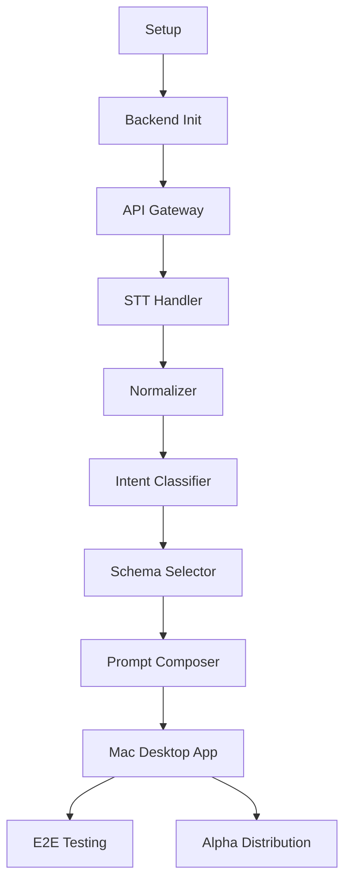

# Implementation Plan: Voice-to-Prompt Engine

**Branch**: `001-voice-to-prompt` | **Date**: 2025-12-05 | **Spec**: [spec.md](./spec.md)
**Input**: Feature specification from `/specs/001-voice-to-prompt/spec.md`

## Summary

Build a cloud-first voice-to-structured-prompt engine that transforms natural human speech into safe, intent-aligned, reliable prompts. The system uses a modular pipeline architecture (STT → Normalize → Intent → Schema → Compose) with a **Mac-first Electron desktop app** that works system-wide across any IDE (Cursor, VS Code, Windsurf) or text input.

**Strategic Pivot (2025-12-06)**: Shifted from VS Code extension to native desktop app for:
- **Better UX**: System-wide global hotkey (tap-to-start, tap-to-stop)
- **Broader reach**: Works in any app where user has a cursor
- **Wispr-like flow**: Paste-at-cursor, floating capture bar, session history

## Technical Context

**Language/Version**: TypeScript 5.x, Node.js 20+  
**Primary Dependencies**: Electron, Express, Zod, OpenAI Whisper API  
**Storage**: Local SQLite/JSON for session history (V1)  
**Testing**: Vitest for unit/integration, Playwright for E2E app testing  
**Target Platform**: macOS desktop app (Electron) + Cloud API backend  
**Project Type**: Desktop application (Electron) + backend API  
**Performance Goals**: < 2.5 sec p95 latency from hotkey release to prompt displayed  
**Constraints**: No autonomous execution, human approval required  
**Scale/Scope**: Single-user focus for V1, Mac-first alpha (unsigned, no Apple Developer account required)

### Mac-First Alpha Approach (Pre-Apple-Account)

- **Phase 1**: Build and run unsigned `.app` locally on developer's Mac
- **Phase 2**: Zip and share with 3-5 trusted testers (manual Gatekeeper bypass)
- **Phase 3**: After validation, invest in Apple Developer account for signing/notarization

## Constitution Check

*GATE: Must pass before Phase 0 research. Re-check after Phase 1 design.*

| Principle | Status | Notes |
|-----------|--------|-------|
| I. Precision Magic | ✅ PASS | Deterministic pipeline, show raw→structured |
| II. Voice-Native | ✅ PASS | Push-to-talk primary interface |
| III. Vertical Slice | ✅ PASS | Single feature E2E before next |
| IV. Full-Stack Testing | ✅ PASS | E2E tests with real Whisper API |
| V. Safety Guardrails | ✅ PASS | Human approval required, no auto-execute |
| VI. LLM-Agnostic | ✅ PASS | Schema-based output, multi-target support |

## Project Structure

### Documentation (this feature)

```text
specs/001-voice-to-prompt/
├── spec.md              # Feature specification
├── plan.md              # This file
├── research.md          # (optional) API research notes
├── data-model.md        # Entity definitions
├── contracts/           # API contracts
│   └── voice-to-prompt.yaml
└── tasks.md             # Task breakdown
```

### Source Code (repository root)

```text
backend/                          # ✅ KEEP - Cloud API (unchanged)
├── src/
│   ├── api/
│   │   ├── routes/
│   │   │   ├── health.ts
│   │   │   └── voice-to-prompt.ts
│   │   ├── middleware/
│   │   │   ├── auth.ts
│   │   │   ├── rate-limit.ts
│   │   │   └── error-handler.ts
│   │   └── index.ts
│   ├── engine/
│   │   ├── pipeline.ts           # Main orchestrator
│   │   ├── stt/
│   │   │   └── whisper.ts        # STT handler
│   │   ├── normalizer/
│   │   │   └── index.ts          # Text normalizer
│   │   ├── intent/
│   │   │   └── classifier.ts     # Intent classifier
│   │   ├── schema/
│   │   │   ├── selector.ts       # Schema selector
│   │   │   └── definitions/
│   │   │       ├── bug-fix.ts
│   │   │       ├── add-feature.ts
│   │   │       ├── explain-code.ts
│   │   │       └── spec-generation.ts
│   │   └── composer/
│   │       └── index.ts          # Prompt composer
│   ├── schemas/
│   │   └── api.ts                # Zod schemas for validation
│   └── utils/
│       ├── logger.ts
│       └── errors.ts
├── tests/
│   ├── contract/
│   │   └── voice-to-prompt.test.ts
│   ├── integration/
│   │   └── pipeline.test.ts
│   └── unit/
│       ├── normalizer.test.ts
│       ├── classifier.test.ts
│       └── composer.test.ts
├── package.json
└── tsconfig.json

desktop/                          # 🆕 NEW - Mac Electron app
├── src/
│   ├── main/
│   │   ├── index.ts              # Electron main process entry
│   │   ├── hotkey.ts             # Global shortcut registration
│   │   ├── recorder.ts           # Audio capture (native)
│   │   ├── paste.ts              # Paste-at-cursor logic
│   │   └── tray.ts               # Menu bar / tray icon
│   ├── renderer/
│   │   ├── index.html            # Main window HTML
│   │   ├── capture-bar.html      # Floating capture indicator
│   │   ├── styles.css            # UI styles
│   │   └── renderer.ts           # Renderer process logic
│   ├── api/
│   │   └── client.ts             # API client (same interface as before)
│   ├── store/
│   │   └── sessions.ts           # Local session history (SQLite/JSON)
│   └── preload.ts                # Electron preload script
├── assets/
│   └── icon.icns                 # macOS app icon
├── package.json
├── tsconfig.json
├── electron-builder.yml          # Build config for macOS
└── forge.config.ts               # (if using Electron Forge)

# 🗑️ DEPRECATED (can be deleted)
extensions/                        # VS Code extension code - no longer needed
companion/                         # Companion app - replaced by desktop/
```

**Structure Decision**: Desktop application (Electron) + backend API. Backend remains a stateless API; desktop app handles audio capture, global hotkey, paste-at-cursor, and session history.

## Component Architecture

### API Gateway

```
POST /v1/voice-to-prompt
├── Request Validation (Zod)
├── API Key Authentication
├── Rate Limiting
└── Forward to Engine Pipeline
```

### Engine Pipeline

```
Audio Buffer
    ↓
┌─────────────────────────────────────────┐
│  STT Handler (Whisper)                  │
│  - Transcribe audio to text             │
│  - Return confidence score              │
└─────────────────────────────────────────┘
    ↓ rawText
┌─────────────────────────────────────────┐
│  Normalizer                             │
│  - Remove filler words (um, uh, like)   │
│  - Detect tone/emotion                  │
│  - Extract possible goals               │
│  - Identify frustrations                │
└─────────────────────────────────────────┘
    ↓ normalizedText, metadata
┌─────────────────────────────────────────┐
│  Intent Classifier                      │
│  - Rule-based (V1)                      │
│  - Categories: bug_fix, add_feature,    │
│    explain_code, spec_generation        │
│  - Deterministic & safe                 │
└─────────────────────────────────────────┘
    ↓ intent, confidence
┌─────────────────────────────────────────┐
│  Schema Selector                        │
│  - Map intent → prompt schema           │
│  - Load schema template                 │
└─────────────────────────────────────────┘
    ↓ schema
┌─────────────────────────────────────────┐
│  Prompt Composer                        │
│  - Fill schema with context             │
│  - Add safety constraints               │
│  - Format as markdown                   │
└─────────────────────────────────────────┘
    ↓
Structured Prompt (ready for LLM)
```

### Mac Desktop App (Electron)

```
User presses global hotkey (e.g., Cmd+Shift+;)
    ↓
┌─────────────────────────────────────────┐
│  Hotkey Manager (main process)          │
│  - globalShortcut.register()            │
│  - Tap once → start recording           │
│  - Tap again → stop & process           │
└─────────────────────────────────────────┘
    ↓
┌─────────────────────────────────────────┐
│  Floating Capture Bar (renderer)        │
│  - Shows "Recording..." animation       │
│  - Visual feedback for user             │
└─────────────────────────────────────────┘
    ↓ on stop
┌─────────────────────────────────────────┐
│  Native Audio Recorder                  │
│  - macOS: AVFoundation or sox           │
│  - Captures WAV/PCM audio               │
└─────────────────────────────────────────┘
    ↓ audio buffer
┌─────────────────────────────────────────┐
│  API Client                             │
│  - POST to /v1/voice-to-prompt          │
│  - Handle errors gracefully             │
└─────────────────────────────────────────┘
    ↓ response
┌─────────────────────────────────────────┐
│  Result Handler                         │
│  - Option A: Paste-at-cursor (Cmd+V)    │
│  - Option B: Open Recent Sessions panel │
│  - Store in local session history       │
└─────────────────────────────────────────┘
    ↓
┌─────────────────────────────────────────┐
│  Recent Sessions Window                 │
│  - List of past transcriptions          │
│  - Raw speech + structured prompt       │
│  - Copy / Paste / Send actions          │
└─────────────────────────────────────────┘
```

### UX Flow Options

**Flow A: Instant Paste** (like Wispr)
1. Tap hotkey → recording starts
2. Speak naturally
3. Tap hotkey again → recording stops
4. Prompt is processed and **pasted at cursor** automatically

**Flow B: Review First** (safety mode)
1. Tap hotkey → recording starts
2. Speak naturally
3. Tap hotkey again → recording stops
4. Recent Sessions window opens with result
5. User clicks "Paste" or "Copy" to use the prompt

## API Contract

### POST /v1/voice-to-prompt

**Request:**
```typescript
{
  audio: string;           // Base64 encoded audio
  context: {
    activeFile: string;    // Current file path
    selectedCode?: string; // Highlighted code
    cursorLine?: number;   // Cursor position
    ideType: 'vscode' | 'cursor' | 'windsurf';
  };
}
```

**Response (Success):**
```typescript
{
  success: true;
  data: {
    rawSpeech: string;         // Original transcription
    structuredPrompt: string;  // Composed markdown prompt
    intent: string;            // Classified intent
    confidence: number;        // 0-1 confidence score
    processingTimeMs: number;  // Pipeline latency
  };
}
```

**Response (Error):**
```typescript
{
  success: false;
  error: {
    code: string;              // e.g., 'TRANSCRIPTION_FAILED'
    message: string;           // User-friendly message
    retryable: boolean;
  };
}
```

## Complexity Tracking

> No constitution violations requiring justification.

| Concern | Decision | Rationale |
|---------|----------|-----------|
| Monorepo vs separate repos | Monorepo | Single feature, shared types, simpler deployment |
| Express vs Fastify | Express | More familiar, sufficient for V1 scale |
| Whisper.cpp vs API | API first | Faster to ship, can add local later |

## Dependencies



### Key Electron APIs Used

| API | Purpose | Docs |
|-----|---------|------|
| `globalShortcut` | Register system-wide hotkey | [electronjs.org/docs/api/global-shortcut](https://electronjs.org/docs/api/global-shortcut) |
| `BrowserWindow` | Main app window + floating capture bar | [electronjs.org/docs/api/browser-window](https://electronjs.org/docs/api/browser-window) |
| `Tray` | Menu bar icon (optional) | [electronjs.org/docs/api/tray](https://electronjs.org/docs/api/tray) |
| `clipboard` | Copy/paste structured prompts | [electronjs.org/docs/api/clipboard](https://electronjs.org/docs/api/clipboard) |
| `systemPreferences` | Check mic permissions on macOS | [electronjs.org/docs/api/system-preferences](https://electronjs.org/docs/api/system-preferences) |
